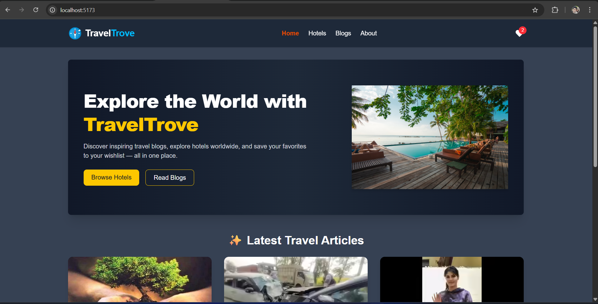
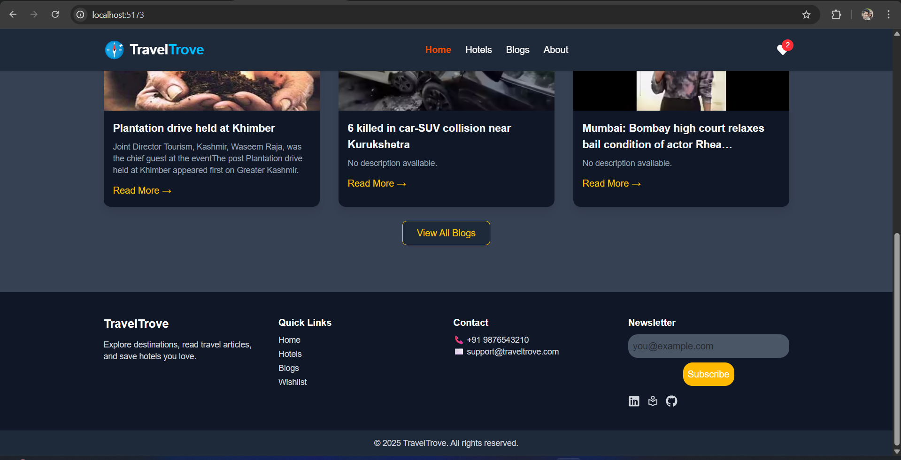
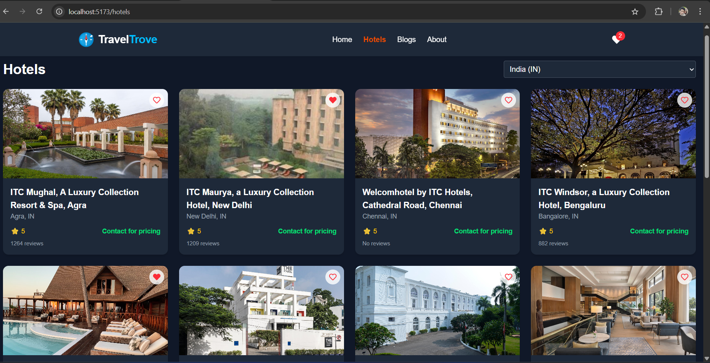
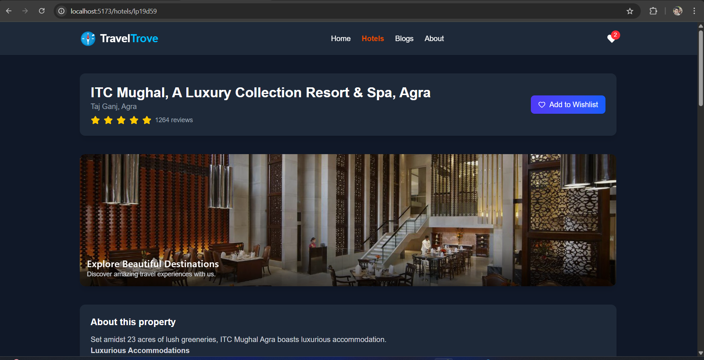
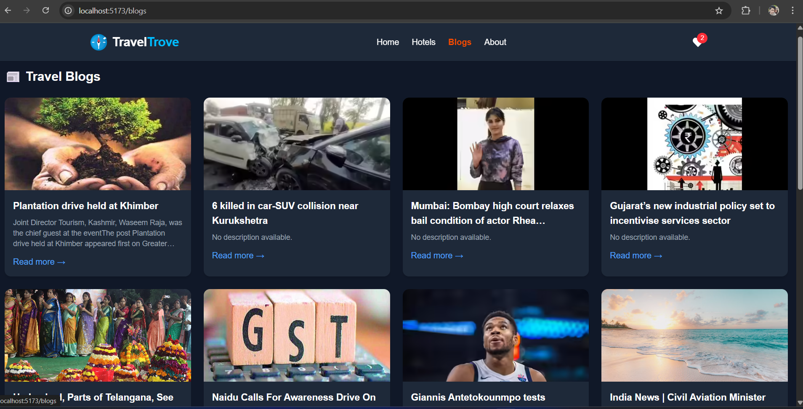
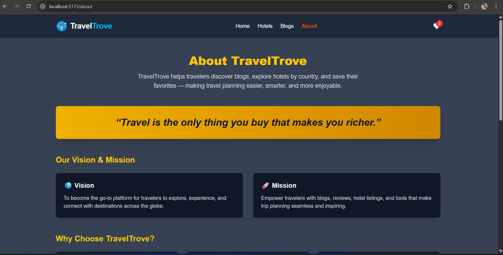
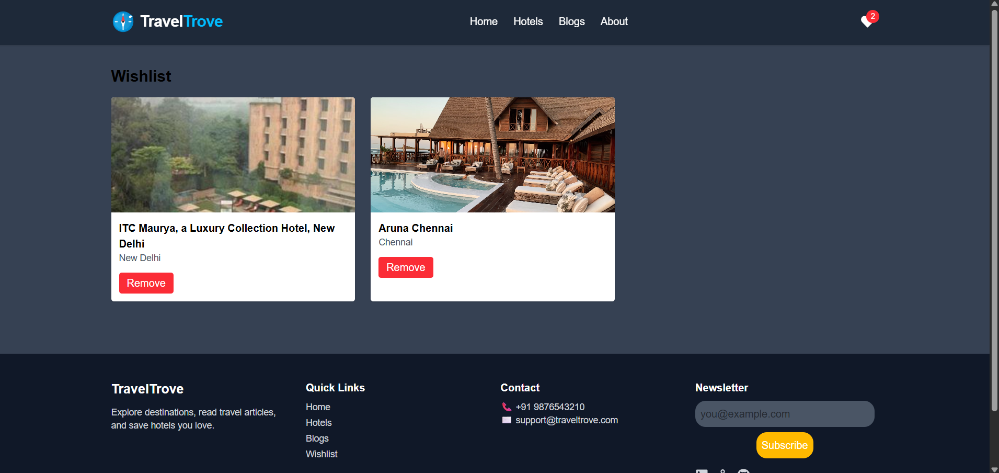

# 🌍 TravelTrove

TravelTrove is a modern travel blog aggregator where users can explore the latest travel blogs and articles from multiple sources.  
It offers a clean, responsive, and engaging interface built with React (Vite), Redux, and TailwindCSS.

---

## ✨ Features

- 📰 Fetches real-time travel blogs from external APIs.
- 🖼️ Smart image handling with fallbacks for broken or missing images.
- 📑 Pagination support for seamless browsing.
- 🏷️ Displays publisher information and publication date.
- 🎨 Responsive, modern UI with hover animations.
- ⚡ Built on **Vite + React** for blazing-fast performance.

---

## 🛠️ Tech Stack

- **Frontend:** React (Vite), TailwindCSS
- **State Management:** Redux Toolkit
- **API Integration:** External Travel Blogs API
- **Deployment:** Render / Vercel / Netlify

---

## 🚀 Outcome

TravelTrove provides users with a visually appealing and highly interactive way to stay updated on travel blogs worldwide.  
The project demonstrates best practices in **API integration, pagination handling, error fallback mechanisms, and modern frontend architecture**.

---

## 📷 Preview

Home page



Hotels



Blogs


About


Favorate


## 📦 Installation & Setup

```bash
# Clone the repository
git clone https://github.com/sandipsinghparmar18/travel-trove.git

# Navigate into the project
cd TravelTrove

# Install dependencies
npm install

# Start the development server
npm run dev
```
